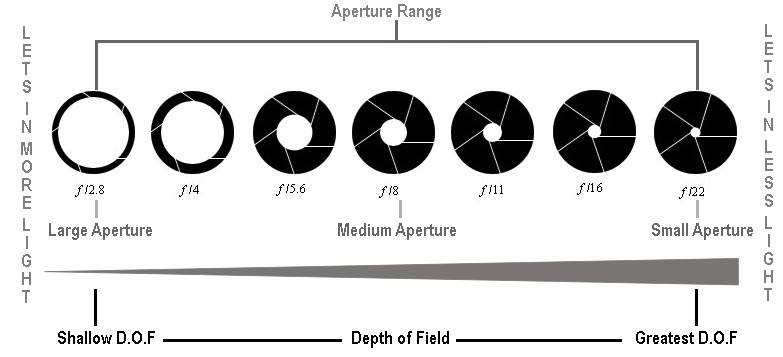
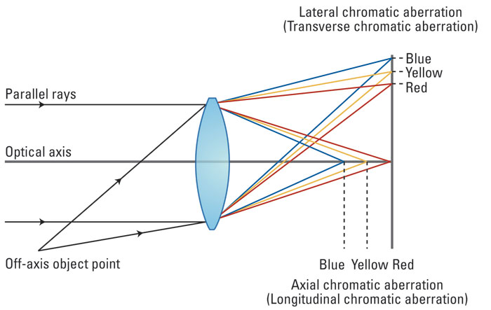

================================================================================
Computer Vision a Modern Approach
================================================================================

--------------------------------------------------------------------------------
Chapter 1: Introduction
--------------------------------------------------------------------------------

--------------------------------------------------------------------------------
Chapter 2: Image Formation
--------------------------------------------------------------------------------

* pinhole camera model
http://en.wikipedia.org/wiki/Pinhole_camera_model

* blur spot
* focal length
* aperture / f-number

large aperture / small f-number:

  - bright image / short exposure time
  - shallow depth of field

small aperture / large f-number:

  - dark image / long exposure time
  - large depth of field

vignetting (lenses in series)

  - layers of lenses reduce total light

chromatic abboration (parts of light have different wavelength)

  - corrected with lens materials / layers

geometric distortion
  - barrel / shear

--------------------------------------------------------------------------------
Chapter 3: Digital Image Sensing
--------------------------------------------------------------------------------

* photon shot noise
* read (thermal) noise
* quantization noise
* dark current noise
* fixed pattern noise

.. image:: digital camera pipeline

--------------------------------------------------------------------------------
Chapter 4: Binary Images
--------------------------------------------------------------------------------

* thresholding

properties of objects
* area (0-moment)
* position (1-moment)
* orientation (2-moment)
* roundedness (ratio of min/max 2-moment)
* connected components
  - region growing algorithm
  - better version
* distance transform
  - skeletonization
  - iterative distance transform
  - better version O(2N)
  - medial axis vs skeletonization
* filtering operations
  - expansion / shrinking
  - structuring element (kernel)
  - erosion / dilation
  - opening / closing

--------------------------------------------------------------------------------
Chapter 5: Image Processing
--------------------------------------------------------------------------------

* pixel proccessing
  - darken:        f - 128
  - lighten:       f + 128
  - invert:        255 - f
  - low contrast:  f / 2
  - high contrast: f * 2
  - grayscale: (3 * f_r + 6 * f_g + f_b) / 10

* convolution
  - take a function, flip, shift to specific point
  - multiple orignal data and integrate (sum)
  - response of some data to a function
  - same for 2d, just flip x and y
  - deconvolution
* linear filter
  - impulse filter (identity kernel)
  - box filter / averaging (will create boxy artifacts)
  - saturated unless it is normalized (sum of weights should be 1)
  - fuzzy filter reduces artifacts (gaussian)
  - the larger the kernel or sigma, the more blurring
  - border problem: ignore, pad with constant, pad with reflection
* non-linear filtering
  - median filter: sort the pixel values in the kernel and take the middle value
  - effective for salt/pepper noise, but not smooth noise
  - bias / bilateral filter: blur pixels that are similar to the center pixel
  - gaussian blurs across edges (bad)
  - spatial gaussian * brightness gaussian
  - how to do airbrussing with strong edges
* template matching
  - minimize sum { sum { (f[x,y] - t[x - i, y - j])^2 } }
  - cross correlation
  - maximize sum { sum { f[x,y] * t[x - i, y - j] } }
  - correlation doesn't flip the kernel, convolution does
  - maximize sum { sum { f[x,y] * t[i - x, j - y] } }
  - need to account for energy difference so large values don't always win

--------------------------------------------------------------------------------
Chapter 6: Edge Detection
--------------------------------------------------------------------------------

* edge detection 1d = derivative along axis
* abs(dx) and find local maxima
* edge detection 2d = partial derivative along each axis (gradient)
* magnitude and orientation of gradient
* gradiant can be approximated with convolution (finite difference):

.. code-block:: text

    [ -1 1 ] * (1 / 2e)
    [ -1 1 ]

* different values and sizes
* roberts, prewitt, sobel 3x3, soble 5x5
* take threshold of magnitude to determine if an edge

  - V >= t: edge, V < t: not edge
  - V >= t1: edge, V < t0: not edge, t0 < V < t1: edge if neighbor is edge
  - Hysteresis thresholding

* second derivate (find zero crossings)
* laplacian: sum of pure second derivatives
* can be approximated with convolution (finite difference):
* noise will make hard to find edge, use a gaussian first
* can apply the gaussian and derivative convolution at the same time

  - first take derivative of gaussion or laplacian and then apply f(x)

* to find corners, take partial derivatives Ix and Iy
* attempt to fit an ellipse to the distribution

  - second moments of each pixel and compute lam1 and lam2
  - small ellipse == no edge (l1 ~ l2 small)
  - tight ellipse == edge (l1 >> l2 or l2 >> l1 one large one small)
  - large ellipse (circle) == corner (l1 ~ l2 large)
  - harris corner response function image: R = l1*l2 - k(l1 + l2)^2
  - k empirically 0.04 <= k <= 0.06
  - R > T: corner, R < T: not a corner
  - choose pixel with highest response in corner pixel cluster
  - non-maximal suppression (finds maxima / minima)

--------------------------------------------------------------------------------
Chapter 7: Boundary Detection
--------------------------------------------------------------------------------

* Fitting lines to edges
  - fine line that minimizes average squared vertical distance
  - least squares (linear regression)
  - use `x sin \theta - y cos \theta + \rho = 0`
  - this minimizes perdendicular distance unlike the slope intercept
  - `y = mx + c`
* Hough transform
  - which lines to fit a line to?
  - convert to f(c,m) = `c = -mx_i + y_i`
  - plot all the lines on the parameter space
  - find the common point using a 2d histogram of the lines
  - use a simple matrix and find local maxima
  - use `x sin \theta - y cos \theta + \rho = 0` => `A(\rho, \theta)`
  - can use heuristics to help: increment a neighborhood, patch a region, etc
  - can also be used with a circle => image space -> parameter space
  - `(x - a)^2 + (y - b)^2 = r^2` => `(a - x)^2 + (b - y)^2 = r^2`
  - can fix the size of `r` to find explicitly sized circles
  - if you don't know `r`, solve for `A(a, b, r)`
  - works on disconnected edges, insensitive to occlusion and noise
  - effective for simple shapes (lines, circles)
  - for complex shapes, generalized hough transform
* Active Contours (snakes)
  - given a contour, deform it to meet edges with high gradient
  - boundary tracking over time
  - can use previous contour to seed the next frame
  - countour is an ordered set of 2d points describing a shape
  - gradient descent towards a blurred gradient magnitude
  - `||\grad \gaussian * I||^2`
  - maximize sum of image gradient at contour points
  - minimize the negative of the gradient
  - sensitivity to noise and initialization
  - can add onstraints to contract and remain smooth
  - elastic (rubberband) and smooth (metallic strip) contours
  - minimize internal bending enery `E_contour = \alpha * E_elastic + \beta * E_smooth`
  - `E_total = E_image + E_countour`
  - penalize deviations from prior shape model
  - requires good initialization; cannot attract contours that are far away
  - can change constants to expand and balloon

--------------------------------------------------------------------------------
Chapter 8: Interest Points
--------------------------------------------------------------------------------

* how to match images
  - remove sources of variations like size, orientation
  - need to find regions of image with rich content
    * (color variations, gradient variations)
  - well defined signature for matching
  - have a well defined position in the image
  - should be invariant to rotation and scaling
  - should be invariable to lighting changes
* use blob like features for 2D recognition
  - edges can move all along the image
  - locate a blob and determine its signature
  - find local extrema in (x, sigma) space (characteristic scale)
  - the sigma at which sigma-normalized second derivative attains its extreme value
  - characteristic scale ~ size of the blob
  - so compute SNSD at many scales and find the maxima/minima
  - 2D version is normalized laplacian of gaussian (NLoG)
* scale space: stack created by filtering an image with gaussians of different sigma
  - increasing sigma blurs / generates a lower resolution image
  - better features exist even at lower resolution
  - optimize with Fast NLoG approximation is Difference of Gaussian (DOG)
  - DoG ~ (s - 1) NLoG (this is what SIFT does)
* SIFT
  - greate a gaussian scale space of the image
  - compute difference of gaussians of the stack
  - find extrema in every 3x3x3 grid (3 stacks, 3x, 3y)
  - this generates interest points (including weak extrema, bad contrast)
  - remove weak points by heuristics (remove bad contrast, edges, etc)
* comparing blobs
  - can scale the size of the blobs based on the sigmas
  - use the histogram of gradient directions to compute orientation
  - find the principal orientation and use that
  - compute histogram of gradient directions of spatial regions for each blob (N)
  - this is the signature of this image (invariant to rotation, scale, brightness)
  - SIFT is the collection of thresholds for this entire process
  - compare those features with L2 distance (the feature arrays)
  - find images that have minimal distances

--------------------------------------------------------------------------------
Chapter 9: Image Segmentation
--------------------------------------------------------------------------------
