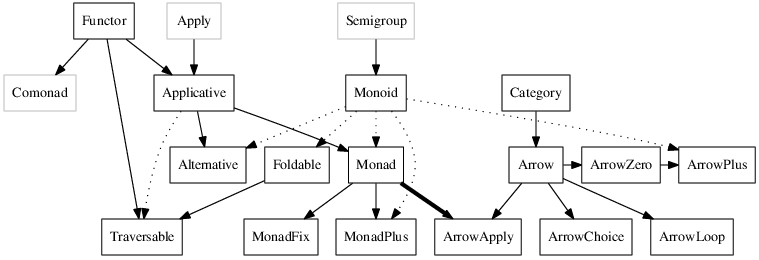

================================================================================
Haskell Typeclasses
================================================================================

`Typeclassopedia <http://www.haskell.org/haskellwiki/Typeclassopedia>`_

--------------------------------------------------------------------------------
Summary
--------------------------------------------------------------------------------

--------------------------------------------------------------------------------
Functor
--------------------------------------------------------------------------------

A simple intuition is that a `Functor` is a container of some sort with the
ability to apply a function over every element in the container. For example, a
`List` using the `map` function. A more general description is that `Functor`
is a computational context. Since `Functor` is included in the `Prelude`, no
special imports are needed to use it. Here is the definition of `Functor`:

.. code-block:: haskell

    class Functor f where
      fmap :: (a -> b) -> f a -> f b
