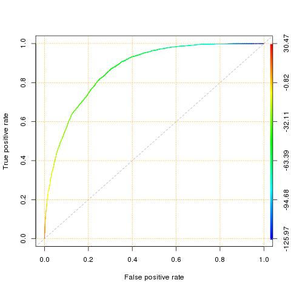

================================================================================
Machine Learning Bootcamp
================================================================================

https://w.amazon.com/index.php/Machine_Learning_Bootcamp

.. code-block:: bash

    ssh ml-bootcamp-60001.pdx1.amazon.com
    sudo mkdir /home/gccollin
    sudo chown gccollin:amazon /home/gccollin
    echo -e "\nexport PATH=\$PATH:/apollo/env/MLEnvImprovement/bin/" >> ~/.zshrc
    source ~/.zshrc
    echo 'com.amazon.access.ML-BOOTCAMP-emluser-1' > /home/gccollin/.emldefaultmaterialset   
    cd /home/gccollin

--------------------------------------------------------------------------------
Summary
--------------------------------------------------------------------------------

There are two main kinds of machine learning:

* **Supervised**
  Given data with labels, can we predict a label for a new example. The primary
  uses for supervised learning are to classification, regression, and ranking.
  Popular algorithms are: linear models, decision trees, random forests,
  K-nearest neighbors, neural networks, and bayesian learning.
* **Unsupervised**
  Given unlabeld data, can we learn something about it. The primary uses for
  unsupervised learning are for clustering, manifold learning, dimensionality
  reduction, association rule mining, and topic models (LDA). Popular algorithms
  are K-means, PCA, and hidden markov models.

.. image:: http://scikit-learn.org/stable/_static/ml_map.png
   :target: http://scikit-learn.org/stable/user_guide.html
   :align: center

In supervised learning there are two main types:

* **Classification** - If the label is a (+) / (-) class or multiclass and we want to
  predict the label of a new example. Algorithms include logistic regression, decision
  trees (leaf is the label), random forests (ensemble), support vector machines,
  and naive bayes.
* **Regression** - If the label is numeric (real) and we want to predict future
  values. Algorithms include linear regression, regression trees (leaf is numeric value),
  and kernel regression.

At the end of the day, given a dataset `X` and a collection of lables `y`, we
are attempting to learn a function `F(x)` such that given a new example `x'`
we will correctly predict its label `y'`. We do this by selecting a function
that will minimize the loss function `F' = argmin_F [ \sum Loss(y_i, F(x_i)) ]`.
Some possible loss functions that we can use are:

* **Squared Loss**  - `L(y, F(x)) = (y - F(x))^2`
* **Logistic Loss** - `L(y, F(x)) = log(1 + \e^(-y * F(x)))` logistic regression if `y = {-1, +1}`
* **Hinge Loss**    - `L(y, F(x)) = max(0, 1 - y * F(x))` support vector machine if `y = {-1, +1}`

A linear classifier can thus be represented as the following:

.. code-block:: text

    decide(kernel(w, x))
    w      = train(X, y)             # the learned weights
    kernel = w . x                   # dot product
    decide = lambda v: v > threshold # classifier
    decide = lambda v: v             # regression

We learn the weights by using *Gradient Descent* to minimize the loss
function that we have selected. This can intuitively be thought as
moving down the gradient (derivative) of the loss function to reach
the lowest minima we can find:

* **Gradient Descent** - `W = W - n * dL/dW` where `n` is the learning parameter
* **BFGS, L-BFGS** -  `W = W - H^-1 * dL/dW` where `H^-1` is the approximate inverse
  of the Hessian matrix (matrix of partial derivatives of the loss function).
- **Stochastic (SGD)** - update weights for single example (online)

Regularization prevents overfitting by penalizing bad weight parameters
(L1 penalizes zero weight values, L2 penalizes large weight values):

* **L1 regularization** - adds `\lam_1 . |W|_1` to the loss function (`\sum |W|` abs)
* **L2 regularization** - adds `\lam_2 . |W|_2` to the loss function (`\sum W^2` norm)
* **Elastic Nea / Lassot** - is a combination of L1 and L2

*Decision Trees* are a simple supervised algoritm that work as follows:

* Split the dataset top down in a greedy fashion along some attribute
* This attribute should encourage purity in the split datasets
* Common purity measurements are entropy, gini index, and variance
* Entropy = `-\sum_c p_c * log(p_c)` where `p_c` is the fraction of examples
  with class label `c`
* The split dataset is pushed into child nodes left < c and right > c
* Recurse and continue until the node entroy is low, a height is reached, or
  some other termination metric
* To predict with this new tree, run the new example against the class lable
  splits until it arrives at a leaf.
* For classification take the mode of the class lable values
* For regression take the mean of the numeric label values

Although trees are easy to train and interpret, they are very prone having
high variance and are susceptible to overfitting (also, their boundaries are
rectilinear). This can be solved by using an ensemble of trees:

1. Bootstrap the samples (introduced diversity)
2. Construct N trees considering random subset of attributes to split on (reduces correlation)
3. Run example through all trees and collect the corresponding labels (reduces variance)
3a. For classification take majority vote of the lable set
3b. For regression take the average of the lable set

.. image:: http://scikit-learn.org/stable/_images/plot_classifier_comparison_1.png
   :target: http://scikit-learn.org/stable/auto_examples/plot_classifier_comparison.html
   :align: center

*K Nearest Neighbors* is another simple algorithm that can learn complex models,
but needs to store all the training examples to predict with. It works as follows:

.. code-block:: python

    def predict(n, k):
        points = sorted(distance(x, n) for x in model)[:k]
        return majority(points)

    distance = euclidean_distance
    majority = majority_vote      # for classification
    majority = mean               # for regression

*K-Means* is an unsupervised algorithm that can learn arbitrary clusters of 
unlabeld data. It works as follows:

.. code-block:: python

    def train(k, dataset):
        centroids = initialize_clusters(k) # random or data based
        while not converged(k):            # rounds, small movement, etc
            groups = { k: [] for k in centroids }
            for e in dataset:
                groups[min((distance(c, e), c)[1] for c in centroids)].append(e)
            centroids = [average(entries) for entries in groups.items()]
        return centroids

    def predict(entry, centroids):
        return min((distance(entry, c) for c in centroids))[1]

    distance = euclidean_distance

--------------------------------------------------------------------------------
Bayesian Learning
--------------------------------------------------------------------------------

.. todo::

--------------------------------------------------------------------------------
Problem Definition
--------------------------------------------------------------------------------

Machine learning problems have three main elements: observation, feature, and label:

* **Observations**
  This is the object or entity that is being learned and predicted on.

* **Features**
  An observation is usually modeled by a set of features (attributes or variables).
  Features can have different data types: numeric (real values), binary (two values),
  categorical (multiple values), unstructured text, or images.

* **Labels**
  This is the value we are trying to predict. Lables are a special requirement
  for supervised learning because we will be learning from categories or values
  in historical data. The training algorithm will try to learn the best model
  that can accurately predict the known label for maximum number of observations
  during the testing phase. When predicting, the model will predict this label
  based on the learned parameters.

The problem definition can then be defined, for example a classification problem
which is an example of supervised learning. This can be binary classification
(spam or not span) or multiclass classification (which product group for an item).

It should be noted that not every problem needs ML to be solved. These include
problems where mappings, computations, or statically created rulesets will
suffice. Furthermore, if the process is relatively static, it will not need
a generalized ML model. The following is a good summary of when to use ML:

* When you can’t code it:  recognizing speech, images, or gestures
* When you can’t scale it: applications involving high speed, large scale of
  data, large number of data points, repetitive tasks needing human-like expertise
  like Recommendations, Spam & Fraud detection.
* When you have to adapt or personalize it: predictive typing (Swype), Kinect
* When you can’t track it: scenarios where the solution changes in time
  dynamically with input such as AI gaming, robot control, jeopardy.

In order to train a ML algorithm, there are a few conditions that must be
met to be successful (balancing 2 and 3 is a decision that must be made):

* You need enough data
* You need a pattern that minimizes mistakes on the training data (complex model)
* You need a pattern to be as generalizable as possible (simple model)
* You need training data that reflects production data

--------------------------------------------------------------------------------
Preprocessing and Data Cleaning
--------------------------------------------------------------------------------

The EML tool needs to know the column names for the input data; these are
specified in a recipe file such as the following:

.. code-block:: text

    types.binary:class
    types.categorical:workclass,education,education-num,marital-status,occupation,relationship,race,sex,native-country
    types.numeric:hours-per-week,age,capital-gain,capital-loss

There are several strategies for handling missing values, but there is no single
solution that will work across all problem types. The correct strategy may need
to be decided on a case by case basis. What follows are a few examples of
strategies that may be used:

- Replacing each missing value with a fixed constant
- Substituting missing values with the mean of observed values for numeric attributes
- Substituting missing values with the mode (most frequently occurring value) for categorical attributes
- Using the attribute values of the nearest neighbors
- Employing regression based imputation

If a learning algorithm works on a single example at a time (online) instead
of a batch, it will help to shuffle the dataset. This can improve the prediction
accuracy as well as the time it takes for the optimization to converge. It should
be noted that this will not help for batch training or training on the entire
dataset.

Outliers are values that are dissimilar from the rest of the data and can
adversely impact model performance. They can be detected by looking at
histograms and box plots. The decision to remove outliers is subjective:

- consider if they are genuine or erroneous
- some algorithms (decision trees) are in general, more resilient to outliers
- the instance can be removed, or changed to another value using the missing value strategies

Features can be scaled to normalize attribute values. For a numeric attribute,
this an be implemented by subtracting the attribute mean from each attribute
value and then dividing the result by the standard deviation. This ensures a faster
convergence of gradient descent based learning algorithms.

.. note::
   Feature scaling rescales attribute values so that they have zero-mean
   and unit-variance, and falls in similar ranges. This can be done by
   setting `x` = (x - mean(X)) / stddev(X)` where `stddev = max(X) - min(X)`.

To handle extremely large datasets, some algorithms train models on random
samples that are much smaller in size. You can preserve class proportions
in the sample using techniques such as stratified sampling. In many applications
(e.g. online advertising), the class distribution is imbalanced with skewed
occurrence of one class (e.g. no-clicks). In these cases, the traning algorithm
may give more importance to the majority class and ignore the minority class.
One strategy to handle this is to downsample the dominant class. This can be
performed by creating a new training dataset that retains all examples
belonging to the minority class and a sample containing an equal number of
examples from the majority class.

Instead of downsampling the majority class, a different strategy is to assign
an importance weight to each example from the minority class. To ensure a
balanced class distribution, the importance weight is the ratio of the
majority and minority classes. This can also be used to heavily penalize
misclassified examples in situations where failed predictions are not
acceptable (adult classificatin).

--------------------------------------------------------------------------------
Data Visualization (R)
--------------------------------------------------------------------------------

All Machine Learning tasks require that developers understand the data. By using
data visualization tools, one can:

* Understand the data better
* Gain insight into the data
* Uncover underlying structure
* Identify important features and detect outliers

There are a number of things to look for when you are investigating the dataset;
the following is a list of such things:

* **Feature / Target Summaries**
  Summary reports can detect outliers and skew in the feature or target data
  distribution. Histograms of indiviual features can be helpful to view data
  summaries.

* **Feature / Target Correlations**
  Knowing the correlation between each feature and the target class is helpful
  in feature selection since a high correlation score implies that there is a
  relationship between the feature and the target class. In general, you want
  to keep the features with high correlation since they are the ones with signal,
  and filter out the features with low correlation since they are most likely noisy.
  This can be examined by looking ate individual feature histograms split by
  the target labels. *Mutual Information* can be calculated as
  `I(X, Y) = \sum_y \sum_x p(x,y) log(p(x,y) / (p(x) * p(y)))`. Finally a
  *covariance matrix* or *Pearsons correlation coefficient* can be used.

* **Feature / Feature Correlations**
  Understanding the correlation between features can tell you which features are
  redundant. For example, if features `f_1` and `f_2` are highly correlated, then
  you may be able to reduce data dimensionality by selecting only one of them.
  These can be investigated with scatter plots with smoothers.

.. code-block:: r

    income <- read.csv('income_train_data.csv', header=T, strip.white=TRUE)
    ?summary           # provides help for the supplied command
    summary(income)    # provides a summary of the dataset
    str(income)        # provides a column labels and data anomolies
    library('ggplot2') # loads the ggplot library for easy plotting
    qplot(data=income, x=age,main="Histogram of Age",binwidth=3)
    qplot(data=income, x=age, main="Class-wise Histogram of Age",  binwidth=3, position="dodge", fill=class)
    age.sal.xtab=xtabs(~age+class, data=income) # distribution of age groups with label

--------------------------------------------------------------------------------
Feature Engineering
--------------------------------------------------------------------------------

The process of manipulating raw data into new and more useful representations or
features is called feature engineering. It is the most critical and time-consuming
step of predictive model building requiring lots of trial and error combined with
domain knowledge and ingenuity. These new features may have more predictive power
than the original raw data which can boost the model performance. These are
generally higher level models. In many cases, linear models with simple features
may not be able to capture complex correlations between the data and the associated
labels.  One way to improve these models is to introduce non-linearity through
feature transformations. There are many types of these feature transformations:

* **Non-Linear** - such as numeric binning and combinations of existing features
  (e.g. quadratic features).
* **Domain-Specific** - such as text features, features that capture the structure
  of web pages, and specialized features (e.g., SIFT) for image data.
* **Data-Driven** - such as meta features derived from clusters within the data.
* **Feature Selection** - selecting a subset of relevant features from a much larger
  set. The insights gained from data visualization can be used to retain features
  that are highly correlated with the target label. This is typically done to elimiate
  noisy or leaky features.

Numeric value binning allows us to introduce *non-linearity* into linear models.
We simply replace a linear value with the bin class value it falls into.
Discretizing numeric values using binning enables models to capture multimodal
relationships of the form: `if age <= 15 or age > 60: the person should earn < $50K`.
Binning allows the classfier to not be distracted by the precision of the number
attribute if it isn't necessarily needed (is there a difference in the prediction
if the user is 30 or 32).  There are a number of binning strategies (although the
best decisions of bin size should be based on experimentation):

- equal ranges
- equal number of examples
- maximize purity measure (entropy)
- supervised binning algorithms based on information gain (classification)
- supervised binning algorithms based on variance reduction (regression)

EML allows this in the recipie file by using rules of the form
`<feature>:quantile_bin:<bin_count>`; for example:

.. code-block:: text

    hours-per-week:quantile_bin:10
    age:quantile_bin:10
    capital-gain:quantile_bin:10
    capital-loss:quantile_bin:10

Another way to introduce non-linear features is with quadratic features.
Quadratic features combine existing features and can generalize to combine
any number of features, which is referred to as the *cartesian product* of
features. In general, you should group base features (income related, family
related, etc) and then combine features from different groups to make new
quadratic features. This is especially helpful if the combined feature is a
text variable containing a sequence of tokens (ex. a book title or binding
descriptors may help in deciding if the book is a text book or trade fiction).
In EMR this is performed as follows:

.. code-block:: text

    processor.cartesian.1: relationship, marital-status
    processor.cartesian.2: relationship, (age:quantile_bin:10)
    processor.cartesian.3: relationship, occupation
    processor.cartesian.4: marital-status, (age:quantile_bin:10)

Other non-linear feature transformations:

* log feature values ensure a more linear dependence with output values
* product/ratio of feature values
* use leaves of fixed depth decision tree as features (train boosted ensemble)
* train on a subset of data, leafs are binary bins, run each example through the tree
* this captures complex relationship between feature values and target

.. note:: linear models are more scalable than non-linear models

There may also be domain specific transformations depending on the data:

* multi-word concepts with frequent N-grams
* parts of speech / ontology tagging (focus on words with specific roles)
* stop words removal / stemming (helps to focus on semantics)
* lowercasing / punctionation removal (standardizes the syntax)
* cutting off very high / lower percentiles
* TF-IDF normalization (corpus wide normalization)
*

It is important to include as many features as possible as this will improve
prediction accuracy by discovering interesting and useful patterns in the data.
It is not possible to know all the features that have signal, so it is best to
include all the featuers and allow the training algorithm to pick the features
with the strongest correlations. This should be balanced with not including
noisy features that have little or no predictive power as they overfit the data.
Once again, the learning algorithm can return importance scores on the features
which an be used to prune away unimportant attributes.

--------------------------------------------------------------------------------
Feature Selection
--------------------------------------------------------------------------------

Often having less features is often better as the model generalizes the behavior
and will prevent overfitting. Many of the features may be strongly correlated or
highly redundant which will affect the performance of the model (overfitting).

To select features that have the highest predictive power:

- features that are strongly correlated with target variables
- information gain, mutual information, chi-square score, pearson's correlation coefficient
- features with high correlation and residual target given other variables
- forward / backward selection, ANOVA analysis
- features with high importance scores (weights) during model training
- remove features with all zero weights

.. todo:: Dimensionality Reduction (random projections, PCA)

Here is an example recipie file for EML that defines a number of features:

.. code-block:: text

    types.binary:class
    types.categorical:workclass,education,education-num,marital-status,occupation,relationship,race,sex,native-country
    types.numeric:hours-per-week,age,capital-gain,capital-loss

    hours-per-week:quantile_bin:10
    age:quantile_bin:10
    capital-loss:quantile_bin:10
    capital-gain:quantile_bin:10

    processor.cartesian.1: relationship, marital-status
    processor.cartesian.2: relationship, (age:quantile_bin:10)
    processor.cartesian.3: relationship, occupation
    processor.cartesian.4: marital-status, (age:quantile_bin:10)
    processor.cartesian.5: marital-status, occupation
    processor.cartesian.6: (age:quantile_bin:10), education
    processor.cartesian.7: (age:quantile_bin:10), (capital-gain:quantile_bin:10)
    processor.cartesian.8: (age:quantile_bin:10), (hours-per-week:quantile_bin:10)
    processor.cartesian.9: (age:quantile_bin:10), sex
    processor.cartesian.10: occupation, education
    processor.cartesian.11: education, (hours-per-week:quantile_bin:10)

--------------------------------------------------------------------------------
Parameter Tuning
--------------------------------------------------------------------------------

Loss function tuning:

- **squared**  - regression, classification
- **logistic** - classification only, better for skewed class distributions
- **hinge**    - classification only, more robust to outliers

Randomly explore join parameter configuration space. You can stop when the model
performance improvement drops below a threshold (branch-bound).

Can also use `k-fold cross validation` to evaluate the model performance for a
given parameter setting:

- randomly split the training data into `k` parts
- train models on `k` training sets, each containing `k-1` parts
- test each model on remaining parts (not used for training)
- average `k` model performance scores
- typical values for `k` are 3 and 5

--------------------------------------------------------------------------------
Training a Model
--------------------------------------------------------------------------------

The quality of the model can be changed by increasing the number of passes on
the data. For a small dataset, the number of interations may need to be larger
while on a very large dataset, a single pass may be sufficient.

What follows is an example run of the EML service with the previously cleaned
dataset and associated configuration:

.. code-block:: bash

    echo -e "PredictionType:binary\nPasses:10" > income_params.txt
    eml upload train.csv
    eml upload test.csv
    eml create predictor                     \
        --labelColumn class                  \
        --recipe ./income_recipe.txt         \
        --dataFileType csv                   \
        --trainingParams ./income_params.txt \
        --trainingFile s3://eml-training-data-123456789101/train.csv
    eml describe predictor --id pr-2014-04-02-81035-jolly-flame

    eml create evaluation --id pr-2014-04-02-81035-jolly-flame                 \
        --evaluationFile s3://eml-training-data-123456789101/gccollin/test.csv \
        --dataFileType csv                                                     \
        --labelColumn class
    eml describe evaluation --id ev-2014-04-02-81740-long-lip

--------------------------------------------------------------------------------
Evaluating a Trained Model
--------------------------------------------------------------------------------

The output of a ML classifier is a prediction score that is then applied to a
threshold: if it is above the threshold it is (+), else it is (-). The problem
with having the classifier choose the threshold directly is:

* **High Precision** - when all positive predictions need to be correct at the
  expense of some positive examples being labled negative.
* **High Recall** - when as many positive examples as possible need to be labled,
  at the expense of some negative examples being misclassified as positive

One way to evaluate the model is to simply calculate the percentage of correctly
classified examples over the total dataset size. This would give us the percent
correctly classified. The problem with this is:

* if the dataset is unbalanced, we can simply just guess the majority classifier
  and achieve 90% accuracy without training a model (e.g. just say no one has
  cancer).
* if the costs of getting a false positive and false negative are not equal, then
  we should allow the user to control the tradeoff (e.g. classifying an email as
  spam vs classifying someone as not having cancer).

*Ultimately, when solving a business problem, the most important metrics are the
ones that are used to measure the problem.* However, it is often not feasible to
collect the business metric directly with each iteration of the ML process. As
such, the next best thing is to find a metric that can be used to evaluate the ML
model and can also be shown to be a good proxy for the business metric, specifically:
it would be good to show that when the ML metric improves, so does the business metric.
Finding an appropriate ML metric is an important part of the ML process.

As a start, the current trend for evaluating a model is the *confusion matrix* which is
a table of all possible combinations of obtained and correct answers. For a binary
classifier this is a 2x2 matrix:

.. code-block:: text

                        actual(1)             actual(0)
    --------------------------------------------------
    prediction(1): true  positive (tp)   false positive (fp)
    prediction(0): false negative (fn)   true  negative (tn)

    precision (p) = TP / (TP + FP) - ability of classifier to not label (+) as (-)
    recall    (r) = TP / (TP + FN) - ability of classifier to find all (+) examples
    f1-score (f1) = (2 * p * r) / (p + r) - single metric linking the two

    true  (+) rate = TP / (TP + FP) - fraction of (+) examples classified correctly
    false (+) rate = FP / (FP + TN) - fraction of (-) examples classified incorrectly

The precision and recall are directly related. You can increase the recall by
lowering the precision and vice versa. One problem with precision and recall is
that they are high level metrics that may not capture the variety and subtlety
of a model's performance (does it perform well on some examples but poorly on
others). The *receiver operating characteristic (ROC) curve* is very useful for
understanding the subtlety in ML performance.  We can then plot an ROC graph
by “sweeping” through the range of all possible thresholds (say from -1 to 1,
one might consider 100 equally-spaced scores as thresholds). For each threshold,
the TPR and FPR are calculated, and the results are plotted on a graph where the
y axis is TPR, and the x axis is FPR. The ideal curve should fit to the upper
right hand corner while a random classifier will be a diagonal line. If the
curve hugs the bottom right corner, you can simply invert the output to make it
a good classifier.

Finally, we can retrieve a metric from the ROC curve by taking the *area under the curve
(AUC)*. The perfect classifier will be 1.0 while the inverted classifier will be 0.0.
The completely random classifier will be 0.5, therefore we want to maximize
`| auc - 0.5|`. It should be noted that EML will select as a threshold the point in
the ROC curve where the difference between TPR and FPR values is at its maximum.

To evaluate the result of our model in EML, we can take the results of the previous
testing step and load them into R:

.. code-block:: r

    # Load our predictions from file
    eml.evaluation <- read.csv("pr-2013-05-02-30501-old-smell_2013-05-02T083206.109_test_result/prediction")
    # Load the ROCR library. If you get an error here, run install.packages("ROCR") and follow prompts
    library(ROCR)
    # Create a ROCR prediction object, by telling the library where to find the model scores and true labels.
    # In this case, score and trueLabel were the columns in the header line of the CSV file that we loaded
    pred <- prediction(eml.evaluation$score, eml.evaluation$trueLabel)
    # Create a ROCR performance object, and instruct it to compute FPR and TPR dimensions - aka the ROC plot 
    perf <- performance(pred, measure = "tpr", x.measure = "fpr") 
    # Plot the graph. Colorize=TRUE adds a threshold color indicator and scale on the right side of the plot
    plot(perf,  colorize=TRUE)
    # Add a grid and a diagonal line to make interpretation easier 
    abline(c(0, 1), col="gray70", lty=2)
    grid(col="orange")

When we test our model against a fairly selected dataset, it may underperform. This is
caused by one of two conditions:

* **Underfitting**
  This is caused by high *bias* which is a measure of the systematic error in the model
  predictions (difference between average prediction and true target). This is usually
  indicative of a model that is too simple and has a small number of features (usually
  linear models). The error rate will be high on the training and test dataset. This
  problem can be solved by increasing the features of the model and decreasing the
  regularization parameters.
* **Overfitting**
  This is caused by high *variance* (the stability or variance in predictions across
  different data samples). This is usually indicative of a model that is too complex
  and has too many features. The error rate will be high only on the test dataset.
  This problem can be solved by increasing the training set, decreasing features,
  and increasing regularization. This is also seen in linear models with many
  sparse features and decision tress (may need to switch model).

--------------------------------------------------------------------------------
Generating Predictions
--------------------------------------------------------------------------------

The EML tool allows for bulk predictions as well as online predictions (with a specified
SLA). To perform the batch prediction, simply upload in batch the data to be

evaluated and the poll on the prediction results:

.. code-block:: bash

    eml predict batch --id pr-2014-04-02-81035-jolly-flame    \
        --inputFile s3://eml-training-data-657675388327/gccollin/income_batch_predict_data.csv
    eml describe batchPrediction --id bp-2014-04-02-82881-busy-goat

--------------------------------------------------------------------------------
Model Retraining
--------------------------------------------------------------------------------

For a model to continue to predict as accurately during training once it has been
put into production, the production data must have a similar distribution to the
training data. Since data distributions can be expected to drift over time, this
may not be a one time exercise, but rather a continuous process. The status of your
model must be monitored and if the data distribution in productions starts to differ
significantly from the training data, the model must be retrained. This training
process should be performed with fresh training data taht reflects the current production
data distribution:

- the model can be trained online with a new collection of production data
- if the monitoring is not prohibitive, a new batch model can be trained when needed
- can also simply train a new model daily, weekly, or monthly

--------------------------------------------------------------------------------
Classifier Scores to Probabilities
--------------------------------------------------------------------------------

* binning method
* modeling via a logistic function

--------------------------------------------------------------------------------
Classifier / Modeling Tips
--------------------------------------------------------------------------------

*The following are some best practices for building high-performance predictive
models using EML:*

* **The More Training Examples, the Better**

  ML models make predictions for a new example based on target labels for similar
  examples in the training data. Consequently, with more training examples, the
  likelihood of finding examples that are similar to a new example increases and
  this leads to more accurate predictions. Thus, larger training sets produce
  models that generalize better to unseen examples. In contrast, with few training
  examples, the model is more prone to overfit the data and thus have poor
  generalization. As a rule of thumb, simple (linear) models with lots of data
  beat complex (nonlinear) models with modest amounts of it.

* **The More Features, the Better**

  More features can improve predictive performance by discovering interesting and
  useful patterns. So in any ML project, it is important to invest sufficient time
  in feature engineering, that is, constructing discriminating features with signal.
  Since it is difficult to guess the features with predictive power exactly, a good
  strategy here is to go with a superset that may include some redundant or noisy
  features - the model training algorithm will simply ignore the features with little
  or no predictive influence (by assigning them low weights) and focus on the features
  with the strongest correlations (by assigning them higher weights).

* **Include non-linear features in models**

  The expressive power of EML’s linear models can be significantly enhanced by including
  non-linear feature transformations. Numeric value binning, text n-grams and quadratic
  features are powerful mechanisms to inject non-linearity into models and can result
  in big gains in the predictive performance of models. For numeric attributes, it is
  also highly recommended to perform feature scaling since this ensures faster
  convergence of model training algorithms. Lowercasing, punctuation removal, stemming
  and stop word removal are also useful transformations to consider for text attributes.

* **Tune Model Training Parameters**

  It is important to explore the parameter space (e.g. number of passes, number of hash
  bits, learning parameters, regularization) during model training - the parameter values
  control factors that affect model quality like convergence of the training algorithm to
  the optimal solution, degree of overfitting and extent of hash collisions. For instance,
  as the number of passes over the training set is increased (beyond 1), the solution gets
  closer to the optimum. Thus, model performance improves with each additional pass although
  the magnitude of the improvement diminishes as the solution approaches the optimum.
  Similarly, increasing hash bits has the effect of reducing collisions, and so should be
  done for large feature spaces. 

* **Avoid Evaluating Model Performance on Training Data**

  A good predictive model generalizes beyond the examples in the training set and performs
  well on unseen data. So it is imperative to use a separate test dataset (different from
  the training set) to evaluate model performance.  A model may perform well on training
  data by overfitting the data rather than learning general patterns. For example, consider
  a simple model that memorizes the training data in its entirety - such a model will
  perfectly predict the training data but will typically fail drastically when making
  predictions about new or unseen data. This is because the model has not learned to
  generalize. A good strategy is to take all available labeled data, and randomly split
  it into training and test datasets. The ratio of 70..80% training, to 20..30% evaluation,
  is commonly used. This ratio ensures that the training and evaluation data are independent
  of each other, and, hopefully, random selection eliminates the selection bias.

* **Avoid Using Test Data to Tune Parameters**

  Using test data to tune model parameters during training can lead to overfitting.
  The correct way to tune parameters is to split the training data into a training set
  and a validation set, and then use the validation set to tune model training parameters.
  Of course, holding out data reduces the amount available for training. This can be
  mitigated by doing k-fold cross-validation that effectively generates k training
  validation splits as follows:
  
  1. randomly divide the training data into k subsets
  2. hold out each one while training on the rest
  3. test each learned model on the examples it did not see
  4. average the results to see how well the particular parameter setting does

* **Ensure Training Data Distribution is in Sync with the Real World**

  Data distributions can change dramatically over time. Consequently, models trained
  on very old data may have poor predictive performance since the current data distribution
  may be very different from that of the training data. So it is important to retrain
  models at regular time intervals (e.g. every day, week or month) with new training data
  to ensure that the models adapt to data distribution changes.
  
  Training data may also be biased depending on the process used to generate examples.
  A better approach to obtain unbiased training sets is to randomly sample observations.
  Furthermore, ground-truth labels for examples can be obtained in a number of different
  ways including (note, it is not advisable to use automated business rules to acquire
  ground truth labels since the models will simply learn the business rules):
  
  1: Human Editors (mechanical turk)
  2: User Feedback (logged actions)

* **Combine Exploitation with Exploration**

  To ensure that models deployed in production adapt to changing data distributions it
  is important to continuously retrain them at regular intervals. In many applications
  like online advertising, the training data comprises newly generated examples as a
  result of user feedback (clicks / no-clicks) to items (ads). Thus, to ensure that
  trained models have high prediction accuracy for new items, explore-exploit algorithms
  (e.g., epsilon-greedy, UCB) should be employed to balance items with high predicted
  values (exploitation) with items whose predictions have high uncertainty (exploration).
  In the event that user feedback is delayed and cannot be obtained in real-time,
  throttling schemes must be employed to limit the exploration of items with inaccurate
  predictions.

* **Pay Attention to Training Data Quality**

  Bad data is more common than one can imagine and adversely impacts model quality. So
  it is critical to ensure that training data is clean by visualizing the data to detect
  skew and errors, doing validation checks and audits for different attribute values,
  removing erroneous records and outliers (spam), and filling in missing values using
  imputation techniques. In addition, randomly shuffling the order of examples in the
  training set can lead to much better models due to faster convergence of model training
  algorithms.  

* **Eliminate Bad, Leaky Features**

  Certain features like the bid price for an ad can be manipulated by end users and so
  are poor features for tasks like click probability prediction. Also, features that
  leak target labels should be dropped during model training. These features assume
  values that are highly correlated with the target in the training data but are absent
  from the test data. For example, in ad click probability prediction, a feature like
  payout amount is non-zero only for clicks and thus leaks information about the target
  label (click / no-click). As a result, it should be expunged from the training data.

* **Use Feature Selection to Prune Noisy Features**

  This is somewhat contradictory to the previous point that recommends including as
  many features as possible. Transformations like n-grams and quadratic can generate
  a massive number of features which can slow down training, lead to overfitting and
  increase the number of hash collisions. Correlation measures such as mutual
  information, the Chi-squared test or information gain can be used to determine the
  predictive power of each feature and prune away noisy features without signal.

* **Select Model Evaluation Metrics that Reflect Business Objectives**

  Applications may have diverse requirements and simply optimizing a single
  evaluation metric like AUC score may not satisfy every business objective.
  For instance, an application for detecting duplicate ASINs may have a
  requirement of 100% precision while a different application for detecting adult
  content may want to maximize recall at the expense of precision. Maximizing recall
  while achieving a target precision is not the same as maximizing AUC scores.
  Similarly, in online advertising, the primary goal is to predict individual ad click
  probabilities as accurately as possible for which the log-likelihood function may
  be a better evaluation metric.

* **Do Not Rely on Offline Tests as a Proxy for Online Performance**

  Online performance of models may be very different from offline tests. Models with
  the highest log-likelihood function values or AUC scores in offline tests may not
  always perform the best in production when deployed online. For example, in ad
  auctions, offline model quality metrics like log-likelihood or AUC are a poor substitute
  for business objectives that require maximizing CTRs and/or revenues. In general,
  offline tests should be mainly used to guide model development and actual model
  performance with respect to key business metrics should be measured in an online setting
  using A/B testing (where a small fraction of real web traffic is diverted to the model).   

* **Use Sampling and Importance Weights to Boost Model Performance**

  Sampling-based techniques such as bagging help to combat overfitting and reduce model
  variance. Bagging builds an ensemble of models on multiple training data samples, and
  aggregates the individual model predictions using either majority voting (for
  classification) or averaging (for regression) to obtain the final prediction. Similarly,
  in imbalanced training data where examples of one class far outnumber the other,
  downsampling the majority class or oversampling the minority class are again good
  strategies to reduce overfitting and obtain models with higher prediction accuracy.
  Finally, when business objectives call for very high precision, then associating
  higher importance weights with examples belonging to the negative class can aid in
  satisfying the objectives while maximizing recall. Similarly, one can obtain very
  high recall by associating high importance weights with examples belonging to the
  positive class. 

--------------------------------------------------------------------------------
EML's Learning Algorithm
--------------------------------------------------------------------------------

Let the training data consist of examples `(x, y)` with feature vector `x_i \e x`
and target label `y`. During model training, EML computes a weight vector `w_i \e w`
so as to optimize a specified objective function (equivalently, minimize some
loss function) over training examples `(x, y)`. For each new example with feature
vector `x`, EML returns a prediction score `w * x` (dot product). This is simply
linear regression. What follows are the details of EML's implementation:

* **Loss Function**

  EML’s training algorithm employs optimization techniques to compute the weight
  vector `w` that minimizes the sum of loss functions `L(w, x, y)` over training
  examples `(x, y)`. EML supports 3 different loss functions: squared (1),
  logistic (2), and hinge (3). Squared loss is applicable to both regression and
  classification problems, while logistic and hinge loss only apply to classification
  problems. By default, the loss function is set to `squared loss`.

* **Stochastic Gradient Descent**

  In order to scale to very large datasets, EML employs the online
  Stochastic Gradient Descent (SGD) learning algorithm to minimize the loss
  function. SGD makes sequential passes over the data, and during each pass,
  updates feature weights with the gradient one example at a time. By default,
  the number of passes is set to `10`.

* **Overall Learning Rate**

  The gradient in each weight update of SGD is multiplied by an overall learning
  rate that is decayed. The rationale for decaying the overall learning rate is
  that, initially the feature weights may be far from the optimal solution, and
  so we need to apply big changes to the weights to rapidly approach the optimal
  solution. But as the weights get closer to the optimum values, we need to
  reduce the magnitude of changes to weights to ensure convergence.

* **Adaptive Learning Rates**

  EML supports adaptive learning rates in which the overall learning rate is
  decayed individually for each feature proportional to the square root of the
  sum of squares of gradients at past examples. The intuition here is that
  feature weights with large past gradients have already had big updates applied
  to them, so it makes sense to more aggressively decay the learning rate and
  dampen the magnitude of subsequent updates to the weights. By default,
  adaptive learning is set to `1`.

* **L1/L2 Regularization**

  L1 and L2 regularization add additional terms `l_1 * ||w||_1` and `l_2 * ||w||_2`
  to the loss function during optimization. Since EML’s optimization algorithms
  attempt to minimize the loss function, the regularization terms penalize larger
  weight values which helps to prevent overfitting. L1 regularization has the effect
  of reducing the number of non-zero weights, while L2 regularization results in
  lower overall weight values. The default values for the L1 and L2 regularization
  parameters are `0`.

* **Feature Hashing**

  In order to handle a large number of features, EML hashes features and then
  learns weights for the hashed features. Feature hashing is essentially a
  dimensionality reduction technique that randomly projects disjoint subsets of
  features onto different hash values. The default value for the number of hash
  bits is `18`.

--------------------------------------------------------------------------------
Validation Techniques
--------------------------------------------------------------------------------

.. todo:: http://research.cs.tamu.edu/prism/lectures/iss/iss_l13.pdf
