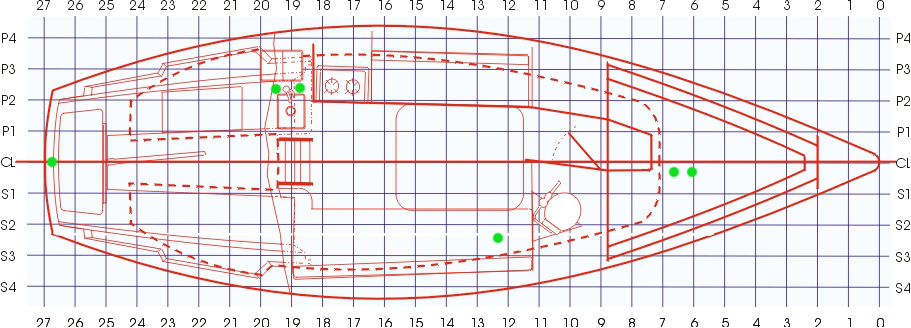

~~~~~~~~~~~~~~~~~~~~~~~~~~~~~~~~~~~~~~~~~~~~~~~~~~~~~~~~~~~~~~~~~~~~~~~~~~~~~~~~
Moonlight Flit
~~~~~~~~~~~~~~~~~~~~~~~~~~~~~~~~~~~~~~~~~~~~~~~~~~~~~~~~~~~~~~~~~~~~~~~~~~~~~~~~

What follows is a guide for the sailboat known as Moonlight Flit. Not only does
this servce as an instruction guide for all the systems, but it also servces as
a repair, maintainence, part listing, and general knowledge of the boat. If
something changes on the boat, please update the documentation so there is no
guesswork when:

* a new person on the boat needs to know how to make it work
* something needs to be serviced or repaired
* something goes wrong and one needs to root cause the issue
* a part gets dropped in the water and needs to be replaced
* understand why decisions were made with the boat when making modifications

================================================================================
Outboard Engine
================================================================================

The sailboat is run with a Mercury 2-Stroke 9.9 HP outboard. It can be fixed in
place so that it does not move, or it can actually be used to steer. The latter
is useful if one is in a situation where they cannot get enough water moving
past the rudder to steer with the tiller. Otherwise, simply raise or lower it,
start or stop it, and then use the tiller to steer. There is no prop walk or
wash with this outboard.

.. todo:: images labeling each component

--------------------------------------------------------------------------------
Starting Operation
--------------------------------------------------------------------------------

#. Turn the (red) battery switch to (1)
#. Open and clip the engine locker open (while using the engine)
#. Put the engine in neutral gear (on the throttle)
#. Pull the engine towards you for one click and then slowly lower in the water
#. Attach the fuel hose
#. Open the gas can vent (unscrew the dime sized knob on top)
#. Pump the primer bulb twice
#. Pull the choke out all the way
#. Turn the choke all the way clockwise (fast idle)
#. Press and hold the starter (black button) for a few seconds until it starts
#. Push the choke in half way
#. Turn the choke slowly all the way counter clockwise (slow idel)
#. Push the choke in all the way
#. Lightly go in gear before returning to neutral
#. Accelerate consistently (do not jump to running at top speed)

--------------------------------------------------------------------------------
Stopping Operation
--------------------------------------------------------------------------------

#. Pull out the fuel hose and store to the side
#. Throttle up to peak for a few seconds
#. Throttle down to just above neutral and let run till it dies
#. If you were in salt water, run a hose near the water intake to flush
#. While in forward gear, pull engine towards you for three clicks
#. Put the engine in neutral gear
#. Close the gas can vent
#. Close the engine locker

--------------------------------------------------------------------------------
What Not To Do
--------------------------------------------------------------------------------

* *Do not switch the battery switch to (off) while the outboard is running*
  This will blow out the alternator if it is wired through the battery switch.

* *Do not run without opening the gas can vent*
  The engine will simply choke out and stall (if it even starts). If it stalls,
  simply open the gas vent and restart.

* *Do not run with the choke open*
  This will choke out the carborator and eventually stall out. If it stalls,
  simply close the choke and restart the engine.

* *Do not leave the outboard sitting in water*
  It will cause the gear box to be overhauled sooner. The gearbox cleaning

* *Do not store after running in saltwater without rinsing*
  This will corrode parts and build up deposits in the engine.

* *Do not use gas without 2-cycle oil added*
  This will burn out the engine.

* *Do not use cheap gas / oil / or gas without stablizer*
  This will gum up the components and will require an overhaul sooner.

* *Do not overprime the engine (pressing the fuel bulb)*
  This will flood the engine which will need to dry before running. To fix this
  you can wait, or you can open the engine, take out the spark plugs, try and
  start it a few times, replace the spark plugs, and you should be good to go.

* *Do not hold the starter for more than five seconds*
  If you do this again and again for too long without breaks in between (say
  5 to 10 minutes), you will burn out the starter motor.

* *Do not run the batteries down*
  If this happens you won't be able to use the ignition switch. If you are near
  the shore, you can plug in the battery charger. If you are on the water, use
  the pull chord and then let the alternator charge the battery back up.

* *Do not remove the outboard without having a halyard attached to it*
  If it falls in the water, getting it out is going to be a pain! Furthermore,
  make sure the safety leash is installed through the transom screws to prevent
  them from unwinding and as a failsafe if they fail. As of now it is attached
  to the rudder post; in the future it should be attached to a secure eye.

--------------------------------------------------------------------------------
Servicing and Parts
--------------------------------------------------------------------------------

* **Zinc Anode**
  *Mfg #42121A2*

  If you wait too long to replace this; getting it off is near impossible.
  I recommend a socket wrench with a long lever arm.

* **Mercury Spark Plugs (2x)**
  *Mfg #33-19424 | NGK BP8HS-15*

  The gap is 1.5mm / 0.060"

* **Outboard Servicing**
  http://ballardmarineservice.com/

  There is one Mercury Licensed service center near Seattle and that is Ballard
  Marine Services. Although they are not cheap, they know what they are doing
  and they are the only certified Mercury dealership in town. If it is a small
  issue like a servicing, find the best cost. However, if there is a problem,
  please just go to them. Be warned, if you ask their opinion on anything, they
  will push the "Mercury" brand (fittings, fuel tanks, paint, etc). The plus
  side is that you know it will work correctly and they will have it in stock.

* **Mercury Engine Paint**
  *Model # 4531208 | Mfg # 802878Q50*

  If you would like to repaint the outboard (say the prop if it is starting to
  weather), then you can get a three stage paint system from mercury. Simply
  sand / steel brush the material down to the metal and then prime / paint /
  gloss.

* **Moeller 6.5 Gallon Fuel Tank**
  *Mfg #620049LP*

  Make sure to only fill to 6 gallons to use the pre-measured ratios for
  the oil and additives. Make sure to fill off the boat so the gas fumes
  will not settle in the cabin. Make sure all the caps are tight and the
  vent is closed after usage.

* **Mercury Fuel Line Quick Connector**
  *Mfg #033418-10*

  Check to make sure this connects to the gas tanks and the male fuel line
  barb correctly and tightly. If this is loose, air and water will get into
  the fuel line.

* **Mercury Fuel Line Kit (Attwood)**
  *Mfg #93806MUS7*

  The reasoning to use this over a cheaper Walmart kit is that this allows low
  permeation allowing less air and water to enter the carb. Cheaper kits will
  stretch and the connections will flex which allows air into the carb which
  causes hiccups and puttering. To install, simply connect the fuel connector
  to the fuel tank you are using (push in, twist clockwise, and pull back to
  test the lock) and then attach the fuel valve to the outboard.

* **Mercury Quickare Fuel Treatment (1)**
  *Model #12419586 | Mfg #8M0047920*

  This should be added every time the fuel is refilled (both left and right
  tanks). For (6) gallons of fuel add 0.6 ounces.

* **Mercury Quickleen Engine and Fuel System Cleaner (2)**
  *Model #12419594 | Mfg #8M0047921*

  This should be added every other time the fuel is refilled. Simply add it to
  the tank on the left and make sure to switch tanks between refills. For (6)
  gallons of fuel add 1.2 ounces.

* **Mercury Quickstor Fuel Stabalizer (3)**
  *Model _ | Mfg #8M0047932*

  Ideally fuel will not be stored over winter and instead dropped off at the 
  hazardous waste dump in the spring. However if there is a good bit of fuel
  left that can be stored, make sure to add this to it.  For (6) gallons of fuel
  add 1.2 ounces.

* **Mercury / Quicksilver Premium 2-cycle oil**
  *Model #542178 | Mfg #858020Q01*

  Do not use cheap 2-stroke oil that you would use in a lawn mower. This gums up
  the engine, causes it to smoke, and idel hard. This should be added at a 50/1
  ratio to the fuel. This means 15.4 ounces or 0.96 pints (one bottle is fine)
  should be added to 6 gallons of gas.

* **Marine Grade Non-Ethanol Unleaded (87) Minimum Octane Fuel**

  The fuel filter for the outboard is pretty simple so it does not remove too
  much from the oil / fuel mixture. Futhermore, the engine does not handle
  ethanol too terribly well and will generally result in water in the fuel line.
  This causes the engine to hiccup, putter, and smoke. Furthermore, using a good
  fuel will keep the servicing costs low and far apart. Morrisons fuel dock in
  south lake union is ideal.

  When you fill up the cans, make sure they are on the ground (not on the boat)
  and fill up to 6 gallons (they hold 6.5 each). This makes sure they are not
  overfilled, gives room to expand, and allows room for the additives. Make
  sure to add the additives first so a good mixture can occur. Another reason
  to fill the tanks off the boat is that gas fumes settle low and could fill
  the cabin.

  The gas tanks should be monitored as the fuel level bob is not too accurate
  (it shows empty with a gallon or so left). Continuing, do not just top off
  the tanks as it is hard to get the mixture correct. Rather, try to fill in
  gallon increments.

================================================================================
Electrical System
================================================================================

--------------------------------------------------------------------------------
Battery System
--------------------------------------------------------------------------------

.. todo:: images labeling each component
.. todo:: electrical diagram

================================================================================
Galley
================================================================================

.. todo
   - organize cleaning products
   - ogranize drawers
   - get basic cutlery, plates, mugs (goodwill trip)
   - get a good cooler fake ice block
   - find a better way to use cooler (quarter berth)

--------------------------------------------------------------------------------
Stove
--------------------------------------------------------------------------------

The stove is a simply alchohol unit. Under the stove is a bottle of stove fuel
that can be used. Simply take off the chopping board, raise the stove by the
handles, and add the fuel to one or both sides if needed. Then light the stove
with the grill lighters from the top drawer and close the stove top. Make sure
that the snuffers are open all the way or closing the top will simply put out
the flame.

To control heat, use the snuffer slider switches. When you want the fire out,
simply close them both. In the top drawer there are put holders, however the
stove really should not be used while sailing (only motoring) as it is not
gimbled and anything hot will simply roll off.

In the back of the cabinet, there is a pot, skillet, and kettle that can be
used for cooking. Make sure to leave the pans on the stove while they are still
hot and do not put the chopping board back on the stove until it is cooled off.

.. todo
  - fix the slider switches (missing one)
  - fix the pot holders
  - add a cheap skillet and basic cooking utensils
  - fix the left stove handle

--------------------------------------------------------------------------------
Grill
--------------------------------------------------------------------------------

The grill on the stern pulpit is a propane Magma <model number>. To use it,
simply take off the cover, insert the fuel regulator, and screw in a Coleman
propane tank. To light:

* push down on the regulator and turn to a high value
* push the Magma ignitor until lit
* turn down the regulator and start cooking

If the ignitor does not work, there are grill lighters in the top drawer in the
galley. To maintain the grill, always take the regulator off and store inside in
the top drawer. Also, always take the propane tank off, cover with the cap, and
store in the port lazarette. Finally, make sure the grill cover is put back on
and the fuel intake pipe cover is back on.

To take care of the inside grill, make sure to wash it with warm soapy water and
oil it before use. For the inner working parts, wash occasionally to remove rust.
The outside can be polished with metal varnish.

The bracket system does not fit exactly, so it needs to be shimmed at all parts
using rubber gasket material. At the moment, everything is just completely
tightened, but this does make it hard to move the grill. Make sure that the
steel tether is always connected to the grill in case any fitting comes loose
as the grill will sink immediatly! It should be noted that Magma over charges
for replacement parts and losing two of the following will cost more than I
paid for all the grill parts together!

* **Coleman 16.4 oz Propane Fuel**
  *Mfg #332409*

  Keep the caps on to prevent dirt getting into the intake and make sure
  to store them in the port side lazarette.

* **Magma Control Valve Regulator**
  Model # 308226 | Mfg # 10-267

  Make sure to take off and store inside the boat. Please put the caps back
  on to prevent dirt entering and oxidation occuring.

* **Magma Radiant Heat Plate**
  Model # 6915011 | Mfg # 10-765

* **Magma Cooking Grill**
  Model # 255929 | Mfg # 10-453

* **Magma Venturi Tube**
  Model # 5925078 | Mfg # 10-160

  Make sure this is tight on the grill and that the cap is placed back on the
  open end after use to prevent dirt build up.

.. todo
   - clean grill insides of rust
   - clean grill top and season it
   - polish outside of grill
   - permanetly fix the shims
   - add cover to grill intake
   - add simple small grill tools

================================================================================
Water System
================================================================================

--------------------------------------------------------------------------------
Fresh Water System
--------------------------------------------------------------------------------

Under the starboard forward bench there is a 10 gallon freshwater tank. At the
moment, the only way to fill this is to run a hose into the boat and fill it.
To fill it simply shine a flashlight and watch the water level rise.

To use it, turn on the water pump from the electrical panel and then use the
second faucet which has a on / off push button switch to pump water or not.
The motor for this is located just aft of the water tank.

It should be noted that at the moment, the drain thru hull has been disabled
for reasons I am not sure (perhaps the previous owner did not understand the
healing issues or they were simply worried about the seacock). As such, the
water will drain from the sink to the port side of the hull. Furthermore, there
is not a drain from that side to the bilge so the water will sit. Before using
the water system, a bucket must be added or simply do not use the water until
the seacocks and drain hose are replaced.

* fresh water tank part
* fresh water pump part
* fresh water pump faucet part
* fresh water hoses parts (y-split) (colored for salt / fresh / waste)
* fresh water diagram

.. todo
   - replace hosing
   - empty, refil, and clean water tank
   - fix pump circuit and pump

--------------------------------------------------------------------------------
Salt Water System
--------------------------------------------------------------------------------

There is a single thru hull under the sink which takes salt-water from outside
the boat into the top sink faucet. This is useful for doing things like washing
dishes before finally rinsing them with the fresh water system. It functions by
using the pump arm on the faucet to draw water.

There is a second thru-hull for the sink and ice box drain. These are shared
via a y-split hose. 

When under sail, the seacocks for both of theses systems should be closed to
prevent salt water from flowing back when healed over. They can be re-opened
when back in crusing mode.

* salt water faucet pump
* salt water hose part
* salt water diagram

.. todo
   - fix salt water pump
   - fix tubing and thru hull test

--------------------------------------------------------------------------------
Head System
--------------------------------------------------------------------------------

The head system is fairly simple. There is a head which has a salt water intake
via a thru-hull under the starboard side bench. The flush system has two modes:

* dry pump out of the head (for removing waste)
* wet pump out of the head (to rinse residuals)

Generally, wet pump before you go to coat the head, then dry pump what you make
and finally wet pump as little as needed. This is because we want to fill the
holding tank as little as possible. From the pump line the waste flows into a 
y-valve that controls weither the waste goes overboard or into the holding tank
(which is actually a PVC bad to save weight). It should be noted that the
current configuration is installed incorrectly so pointing to the holding tank
actually pumps over. Keep this in mind.

When the head is not in use, make sure the pump is left on the dry mode which
will keep the tank from filling when healed over.

To clean the head system, there is a pump-out on the hull which can be opened
with a standard deck key and cleaned at the pump out station. When pumping out,
make sure to rinse with water and bleach after fully emptying the tank. This
will keep the smell down.

Every so often, run white vinegar through the head system if you are pumping out
or bleach if you are running into the tank.

.. todo:: images labeling each component
.. todo:: water diagram

.. todo
   - clean head
   - oil valves (flush oil)
   - tighten connections / tubing
   - add handle while peeing
   - add basic toiletries

================================================================================
Running Rigging
================================================================================

.. todo:: images labeling each component
.. todo:: line diagram
.. todo:: line listing

--------------------------------------------------------------------------------
Rigging Ordering List
--------------------------------------------------------------------------------

What follows is an order list for the current running rigging:

* **Cunningham / Downhaul**
  
  - 15" @ (3/8") Samson White XLS
  - whipped on bitter end (finish with stopper knot)
  - 1 inch eye on working end (connects to block clevis pin)

* **Boom Vang**
  
  - 40" @ (3/8") Samson Black XLS
  - whipped on bitter end
  - 1 inch eye on working end (connects to block clevis pin)

* **Spinnaker Halyard**
  
  - 90" @ (5/16") Samson Blue/White MLX
  - whipped on bitter end (finish with stopper knot)
  - spliced to swivel snap shackle on working end

* **Spinnaker Sheet (x2)**
  
  - 55" @ (3/8") Samson Blue XLS
  - whipped on bitter end
  - spliced to soft dynema shackle on working end (connects to clew)

* **Fore Sail Halyard**
  
  - 83" @ (5/16") Samson Green/White MLX
  - whipped on bitter end (finish with stopper knot)
  - spliced to snap shackle on working end

* **Main Sail Halyard**
  
  - 83" @ (5/16") Samson Red/White MLX
  - whipped on bitter end (finish with stopper knot)
  - spliced to halyard shackle on working end

* **Main Sail Sheet**
  
  - 75" @ (3/8") Samson Red XLS
  - whipped on bitter end (finish with stopper knot)
  - 1 inch eye on working end (connects to block clevis pin)

* **Fore Sail Sheet**
  
  - 75" @ (3/8") Samson Green XLS
  - whipped on bitter end (finish with stopper knot)
  - whipped on working end (connect with bowline)

* **Fore Sail Furling Line**
  
  - 75" @ (1/4") Samson Yacht Braid White/Green XLS
  - continuous loop

* **Main Sail Reefing Line**
  
  - 50" @ (5/16") Samson Yacht Braid White/Red XLS
  - whipped on bitter end
  - whipped on working end

* **Spinnaker Tack Line**

  - 15" @ (5/16") Samson Black/White MLX
  - whipped on bitter end (to cleat)
  - spliced to soft shackle on working end (to tack pendant)

* **Main Sail Outhaul**

  - ?

* **Traveler Sheet (x2)**

  - 15" @ (5/16) Samson Solid Black XLS (Mfg #456020205030)
  - 1 inch eye on working end (connects to block)
  - black stopper ball on working end (Mfg #RF1315BLK)

--------------------------------------------------------------------------------
Roller Furler
--------------------------------------------------------------------------------

--------------------------------------------------------------------------------
Control Lines
--------------------------------------------------------------------------------

--------------------------------------------------------------------------------
Tiller / Rudder
--------------------------------------------------------------------------------

================================================================================
Underway
================================================================================

--------------------------------------------------------------------------------
Under Motor
--------------------------------------------------------------------------------

* very lee heavy / pushed by wind current easily
* reverse is hard
* needs lots of speed to be steerable

--------------------------------------------------------------------------------
Under Sail
--------------------------------------------------------------------------------

* lots of weather helm; travel down from center to balance
* boom vang doesn't do much
* cunningham and tight halyard for old sails
* outhaul not too useful for old sail
* downwind is slow unless spinnaker or wing out

================================================================================
Standing Rigging
================================================================================

================================================================================
Mast
================================================================================

.. todo:: electrical diagram
.. todo:: line diagram
.. todo:: parts listing (sheaves, rollers)

================================================================================
Sails
================================================================================

.. todo:: images labeling each sail
.. todo:: use case of each sail (head sail)
.. todo:: measure existing sails

--------------------------------------------------------------------------------
Measurements
--------------------------------------------------------------------------------

**Catalina 27**

.. code-block:: text

    I    = 34.4 ft  / 10.49 m
    J    = 11.2 ft  /  3.42 m
    P    = 28.6 ft  /  8.71 m
    E    = 10.5 ft  /  3.19 m
    ISP  = 34.4 ft  / 10.49 m
    JSP  = 11.2 ft  /  3.42 m
    PY   = NA
    EY   = NA

    * I     = measured along the front of mast from the genoa halyard to the main deck.
    * J     = the base of the foretriangle measured along the deck from the headstay pin to the front of the mast.
    * P     = the luff length of the mainsail, measured along the aft face of the mast from the top of the boom to the highest point that the mainsail can be hoisted.
    * E     = the foot length of the mainsail, measured along the boom from the aft face of the mast to the outermost point on the boom to which the main can be pulled.
    * ISP   = similar to I. It is measured from the highest spinnaker halyard to the main deck.
    * JSP   = the length of the spinnaker pole or the distance from the forward end of the bowsprit (fully extended) to the front face of the mast.
    * Iy    = the measurement from the staysail halyard to the main deck.
    * Jy    = the measurement from the staysail stay pin to the front face of the mast.
    * LP    = the shortest distance between the clew and the luff of the genoa.
    * Py/Ey = respectively, are the luff length and foot length of the mizzen of a yawl or ketch, measured in the same way as for the mainsail.

**Approximate Sail Area**

.. code-block:: text

    * Mainsail                        = (P x E) / 1.87           = 171.4 ft^2 / 16.17 m^2
    * 155% Genoa                      = (( J x I ) / 2) x 1.63   = 314.7 ft^2 / 29.24 m^2
    * 135% Genoa                      = (( J x I ) / 2) x 1.42   = 274.2 ft^2 / 25.47 m^2
    * 100% Jib                        = ( I x J ) / 2            = 203.0 ft^2 / 18.86 m^2
    * Racing Symmetrical Spinnaker    = 1.5 x J x I              = 575.5 ft^2 / 53.47 m^2
    * Racing Asymmetrical Spinnaker   = 1.5 x J x I              = 575.5 ft^2 / 53.47 m^2
    * Cruising Asymmetrical Spinnaker = 1.4 x J x I              = 536.0 ft^2 / 49.80 m^2

**Main Sail**

.. code-block:: text

    * Luff  =  28.67 ft   /  8.738 m
    * Foot  =  10.50 ft   /  3.200 m
    * Leech =  29.91 ft   /  9.116 m
    * Diag  =  30.19 ft   /  9.201 m
    * Head  =   4.50 in   /    114 mm
    * Area  = 154.18 ft^2 / 14.324 m^2

**Jib Sail 100%**

.. code-block:: text

    * Luff   =   29.50 ft   /  8.991 m
    * Foot   =   13.75 ft   /  4.190 m
    * Leech  =   26.75 ft   /  8.153 m
    * L-Perp =   12.45 ft   /  3.794 m
    * Area   =  183.71 ft^2 / 17.067 m^2

**Storm Jib Sail**

.. code-block:: text

    * Luff   =  19.96 ft   / 6.083 m
    * Foot   =   8.46 ft   / 2.578 m
    * Leech  =  16.32 ft   / 4.974 m
    * L-Perp =   6.75 ft   / 2.057 m
    * Area   =  67.36 ft^2 / 6.258 m^2

**Genoa Sail 135%**
**Genoa Sail 150%**

**Symmetrical Spinnaker**

.. code-block:: text

    * Stay   =  34.47 ft   / 10.506 m
    * Foot   =  20.25 ft   /  6.172 m
    * Girth  =  20.25 ft   /  6.172 m
    * Area   =  593.0 ft^2 / 55.092 m^2

**Asymmetrical Spinnaker**

.. code-block:: text

    * Luff   =  19.96 ft   / 6.083 m
    * Foot   =   8.46 ft   / 2.578 m
    * Leech  =  16.32 ft   / 4.974 m
    * L-Perp =   6.75 ft   / 2.057 m
    * Area   =  67.36 ft^2 / 6.258 m^2

================================================================================
Storage and Organization
================================================================================

--------------------------------------------------------------------------------
Anchors
--------------------------------------------------------------------------------

There are three anchors aboard the boat:

* **Delta Bow Anchor**
 
  This is on the anchor roller on the bow and has its rode run through the
  hawsepipe and into the locker at the front of the V-birth. It has 160 ft of
  rode (15 ft chain) and is permanently connected to a steel ring that prevents
  it existing from the hawsepipe.

* **Danforth Stern Bucket**
  
  Under the companionway steps is a Danforth attached to 90ft of rode (all rope)
  collected in a organizer bucket. To get to this, simply remove the ladder and
  cary the bucket and anchor to the stern. Make sure that you connect the bitter
  end from the back of the bucket to a cleat before you lower the anchor.
  If you need more rode, use a Zepplin knot to attach more.

* **Backup Danforth**
  
  There is a lightweight Danforth folded up in the port Lazarette that has no rode
  attached to it. This is here in case you have to have to drop one of the anchors
  and need a backup. Attach it to the chain rode using a shackle or to the rope
  rode using an anchor hitch or a shackled eye loop.

* `Zepplin Knot <http://www.animatedknots.com/zeppelin/>`_
* `Anchor Hitch Knot <http://www.animatedknots.com/anchor/>`_
* `Anchor Selection Guide <http://www.westmarine.com/WestAdvisor/Selecting-The-Right-Anchor>`_
* `How to Anchor <http://www.westmarine.com/WestAdvisor/How-To-Anchor-Securely>`_

================================================================================
Boat Hull
================================================================================

--------------------------------------------------------------------------------
Thru Hulls
--------------------------------------------------------------------------------

The boat has (5) thru hull points not including the drain points from the
cockpit to the transom:

#. Under the sink salt water pump intake
#. Under the sink ice-box and sink drain
#. Under the starboard bench for head intake / exhaust
#. Under the v-berth starboard depth sounder
#. Under the v-berth starboard knotmeter transducer

The bungs for the thru hulls are located in the port locker (sliding white tray).
The screw bung for the instrument transducers is in the same package.

--------------------------------------------------------------------------------
Internal Maintenance
--------------------------------------------------------------------------------

--------------------------------------------------------------------------------
Outside Cleaning
--------------------------------------------------------------------------------

To clean the deck, any standard boat cleaning soap is fine. Every so often,
simply mix some concentrate in a bucket and scrub down the deck. Rinse when
complete. No need to polish or wax as a new gelcoat is needed first.

If you have been sailing in saltwater, rinse the boat off after usage (or if
beer has been spilled in the cockpit). There is a coiled hose located in the
port lazarette.

Make sure the lines are all hanging and not sitting in water to prevent mold
and aging the line.

To polish the hardware, use a plastic polishing agent to defog and clean all
the plastic hardware (simply polish on and wipe off). For metal hardware, use
the metal polish in the cabin (simply polish and wipe off).

--------------------------------------------------------------------------------
Deck Maintenance
--------------------------------------------------------------------------------

On the boat is a collection of epoxy and gel coat materials. At the moment, the
only aim is to keep the boat dry and solid as the deck is quite old. As such,
make sure hardware is installed sercurely, correctly, and bedded in a water
tight manner. If there are any holes down to epoxy or worse wood, simply seal
them off with epoxy.

For guides on how to perform the work, these resources are invaluable:

* `Boat Projects <http://www.pbase.com/mainecruising/boat_projects>`_
* `Boat Works Today <https://www.youtube.com/user/boatworkstoday>`_

--------------------------------------------------------------------------------
Hull Maintenance
--------------------------------------------------------------------------------

================================================================================
General Information
================================================================================

--------------------------------------------------------------------------------
Bridge Clearance
--------------------------------------------------------------------------------

Basically assume that the boat is 40' tall and you should be okay going through
everything larger than that (the following are at mean regulated lake level at
the center of the bridge or high tide in question):

* **Burlington-Northern RR Bridge** - 42 feet (206-784-2976)
* **Ballard Bridge** - 44 feet (206-282-9525)
* **Fremont Bridge** - 30 feet (206-386-4234)
* **University Bridge** - 42.6 feet (206-684-4765)
* **Montlake Bridge** - 46 feet (206.720.3048)
* **Mercer Island Bridge West** - 28 feet
* **Mercer Island Bridge East** - 65 feet
* **520 West Passage** - 43 feet (206.440.4490)
* **520 East Passage** - 70 feet (206.440.4490)

If you need the bridge to open, you can do one of the following:

* One long blast followed by one short blast as you approach the bridge
* Call the bridge operator on Marine Channel 13 as you are in sight
* Call the supplied phone number to schedule an arrival

When you go the horn route, the bridge operator will blow back (5) short blasts.
This should be interpreted as "I heard you, and I will open the bridge the next
chance I get" rather than the usual "I do not understand / I cannot do that."

If you are going through the locks, make sure to put two bumpers on each side of
the boat and bow and stern lines on both sides of the boat. This will prevent
any last second swapping around. Just to prevent any problems, simply leave the
outboard in neutral or make sure it can be started before the locks open to the
sound. There is a great deal of current that will quickly sweep you to the rail
bridge.

--------------------------------------------------------------------------------
Contacts
--------------------------------------------------------------------------------

The following services can be contacted via phone or VHF radio:

* **Hiram Chittenden Locks** - 206-783-7000
* **US Coast Guard** - 206-217-6001
* **Harbor Patrol** - 206-684-4071
* **US Marine Forecaster** - 206-526-6087
* **Canada NEXUS Clearance** - 800-562-5940
* **Distress and Urgent Traffic** - Channel 16
* **Bridge to Bridge** - Channel 13
* **Vessel Traffic Services** - Channel 14
* **Marina Operations (all)** - Channel 66A

If you want to talk to another non-commercial port or ship, use the following
VHF channels: 68, 69, 71, 72, and 78A. For more information on working with VHF,
use the following guide:

* `VHF Basics <http://www.boatus.com/boattech/casey/vhf-basics.asp>`_

--------------------------------------------------------------------------------
Weather / Tides / Currents
--------------------------------------------------------------------------------

When you are making a trip, it is a good idea to simple write out a table of the
tides and currents for where you will be along with a summary of the expected
weather. The following can help with making these plans:

* `Deep Zoom Current Predictions <http://www.deepzoom.com/#about>`_
* `NOAA Seattle <http://www.wrh.noaa.gov/sew/>`_
* `NOAA Buoy Data <http://www.ndbc.noaa.gov/maps/Northwest.shtml>`_
* `NOAA Buoy Data (West Point) <http://www.ndbc.noaa.gov/station_page.php?station=wpow1>`_
* `Washington Ferry Weather <http://i90.atmos.washington.edu/ferry/Ferryjs/mainframe1.htm>`_
* `NOAA Graphical Forecast <http://graphical.weather.gov/sectors/sew.php>`_
* `Puget Sound Coastal Waters Forecast <http://weather.noaa.gov/cgi-bin/fmtbltn.pl?file=forecasts/marine/coastal/pz/pzz135.txt>`_
* `Puget Sound Tide Predictions <http://www.dairiki.org/tides/daily.php>`_
* `NOAA Seattle Tides <http://tidesonline.noaa.gov/plotcomp.shtml?station_info=9447130+Seattle,+WA+&flag=0>`_
* `PNW Marine Report <http://www.atmos.washington.edu/data/marine_report.html>`_
* `NOAA Current Predictions <http://tidesandcurrents.noaa.gov/noaacurrents/Regions>`_
* `Shilshole Water Conditions <https://tidesandcurrents.noaa.gov/stationhome.html?id=9447130>`_
* `Windyty Wind Forecasts <https://www.windyty.com/?47.610,-122.334,3>`_

--------------------------------------------------------------------------------
Crusing Information
--------------------------------------------------------------------------------

The following is a grab bag of sailing resources that should be invaluable to one
cruising in the PNW. Also note there a number of guides and books on the tablet
in the boat:

* `Waggoner Cruising Guide <http://waggonerguide.com/>`_
* `Magnetic Declination Calculator <http://www.ngdc.noaa.gov/geomag-web/#declination>`_
* `Magnetic Declination <https://www.ngdc.noaa.gov/geomag/declination.shtml>`_
* `Shilshole Cruising Distances <http://nwcruising.net/nm_folders/shilshole.html>`_
* `Sailing Resources <http://www.islandsailing.org/sailor-resources/>`_
* `Marine Project Guides <http://www.pbase.com/mainecruising/boat_projects>`_
* `Vessel Finder <https://www.vesselfinder.com/>`_
* `Ferry Watch <http://www.wsdot.com/ferries/vesselwatch/>`_
* `Nautical Charts and Resources <https://sites.google.com/site/nauticalfree/#US>`_
* `NOAA Charts (Lake Union / Lake Washington) <http://www.charts.noaa.gov/OnLineViewer/18447.shtml>`_
* `PNW Coast Pilot Volume 7 <http://www.nauticalcharts.noaa.gov/nsd/coastpilot_w.php?book=7>`_

--------------------------------------------------------------------------------
Useful Books
--------------------------------------------------------------------------------

* `Annaoplis Book of Seamanship <https://www.amazon.com/Annapolis-Book-Seamanship-Fourth/dp/1451650191/>`_
* `Chapman Piloting and Seamanship <https://www.amazon.com/Chapman-Piloting-Seamanship-Small-Handling/dp/1588169618/>`_
* `The Complete Sailing Manual <https://www.amazon.com/Complete-Sailing-Manual-Third/dp/0756689694/>`_
* `US Chart Number 1 <https://www.amazon.com/U-S-Chart-No-Abbreviations-Navigational/dp/1937196976/>`_
* `Navigation Rules and Regulations <https://www.amazon.com/Navigation-Rules-Regulations-Handbook-Coast/dp/1937196232/>`_
* `Complete Sailboat Maintenance Manual <https://www.amazon.com/Caseys-Complete-Illustrated-Sailboat-Maintenance/dp/0071462848/>`_
