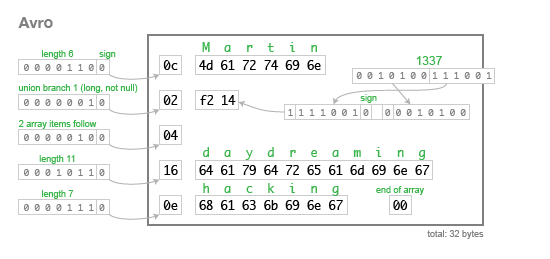
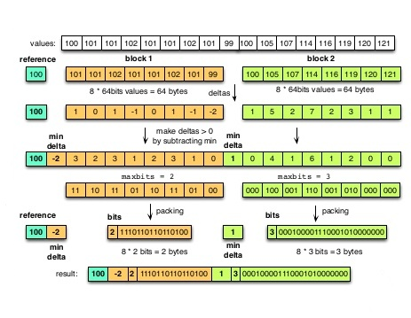
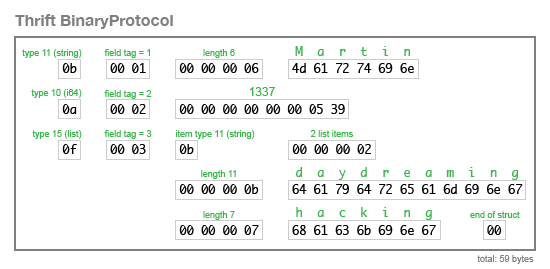
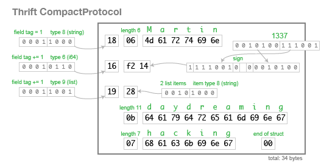
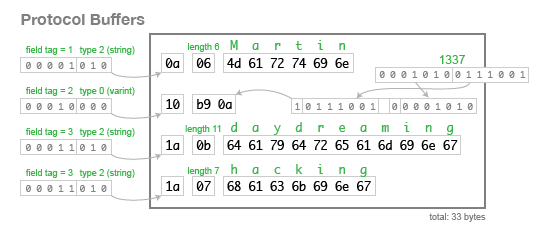

================================================================================
Serialization Formats
================================================================================

http://martin.kleppmann.com/2012/12/05/schema-evolution-in-avro-protocol-buffers-thrift.html

--------------------------------------------------------------------------------
Avro
--------------------------------------------------------------------------------

Links

* http://avro.apache.org/
* http://avro.apache.org/docs/1.7.2/api/java/org/apache/avro/io/parsing/doc-files/parsing.html

Given the following schema, it will be encoded as follows:

.. code-block:: json

    {
        "type": "record",
        "name": "Person",
        "fields": [
            {"name": "userName",        "type": "string"},
            {"name": "favouriteNumber", "type": ["null", "long"]},
            {"name": "interests",       "type": {"type": "array", "items": "string"}}
        ]
    }

.. code-block:: c

    record Person {
        string               userName;
        union { null, long } favouriteNumber;
        array<string>        interests;
    }

* There are no type tags so for the parser to decode

  - it needs the exact same version of the encoding schema
  - it needs the schema while decoding to interpret the data
  - although you can have two versions (reader / consumer and writer / producer)

* For schema evolution

  - there is no such thing as an optional field in avro
  - the only option is a union { null, <type> } (a byte will mark null)
  - if a union is updated, all readers must first get the schema, then writers
  - you can add a new field if it has a null default
  - you can remove a field if it has a null default

* To know the schema being used

  - hadoop stores the schema used in the object container file
  - for RPC, the server can negotiate the schema once in long lived connections
  - otherwise, perhaps store the schema version in the record (or hash)
  - the schema can then be stored in a registry keyed by its version

If protobuffers have every field in a record tagged, in avro the entire
record, file, or network connection is tagged with the schema version.

--------------------------------------------------------------------------------
Parquet
--------------------------------------------------------------------------------

Links

* http://parquet.incubator.apache.org/
* https://blog.twitter.com/2013/dremel-made-simple-with-parquet

* delta encoding
  - for sorted data with minimal variation

* prefix coding
* dictionary encoding
* run length encoding
* predicate pushdown (rows)
* projection pushdown (columns)

--------------------------------------------------------------------------------
Message Pack
--------------------------------------------------------------------------------

Links

* http://msgpack.org/

--------------------------------------------------------------------------------
Thrift
--------------------------------------------------------------------------------

Links

* https://thrift.apache.org/

Given the following schema, it will be encoded as follows:

.. code-block:: c

    struct Person {
      1: string       userName,
      2: optional i64 favouriteNumber,
      3: list<string> interests
    }

The binary protocol is a straight encoding of the schema, but it is somewhat
wasteful as it includes the schema in each message. The compact protocol uses
variable-length integers and bit packing to save space (similar to protobuffers).
The only difference is how it explicitly has a list type instead of repeated tags
like protobuffers.

Unlike most of the other serialization libraries, Thrift is a bit more complex.
it actually has a number of serialization formats (protocols) including two JSON
and three binary. It also includes a full RPC framework.

--------------------------------------------------------------------------------
Protocol Buffers
--------------------------------------------------------------------------------

Links

* https://developers.google.com/protocol-buffers/
* https://developers.google.com/protocol-buffers/docs/encoding

Given the following schema, it will be encoded as follows:

.. code-block:: c

    message Person {
        required string user_name        = 1;
        optional int64  favourite_number = 2;
        repeated string interests        = 3;
    }

* there is no difference in encoding optional, required, and repeated

  - the parser just uses application level rules to use the values
  - optional field tags simply use the last seen value
  - repeated field tags can be included many times
  - required field tags will exist only once

* the schema can evolve as long as field number tags are not reused

  - optional fields can be removed
  - new fields can be added
  - old schemas can ignore unknown fields by the length prefix

* the parser knows how to parse a type based on its prefix tag

  - [x x x x x 0 0 0] (variable length encoded int)
  - [x x x x x 0 0 1] (fixed length 64-bit numeric)
  - [x x x x x 0 1 0] (UTF-8 string) [length delimited]
  - groups are deprecated
  - [x x x x x 1 0 1] (fixed length 32-bit numeric)

The scheme for variable length integers is as follows:

.. code-block:: text

    [0 0 0 0 0 0 0 1]                  == 1
    [1 0 1 0 1 1 0 0][0 0 0 0 0 0 1 0] == 300

    - MSB of byte indicates if there are more bytes
    - integer is stored least significat group first
    - to decode, drop MSB, reverse, and concatenate

    [1 0 1 0 1 1 0 0][0 0 0 0 0 0 1 0]
    [  0 1 0 1 1 0 0][  0 0 0 0 0 1 0]
    [  0 0 0 0 0 1 0][  0 1 0 1 1 0 0]
    [0 0 0 0 0 0 0 1][0 0 1 0 1 1 0 0]
                   256 + 32 + 8 + 4 == 300

Google has later added an RPC framework based on protobuffers and which is
similar in scope to Thrift. It is based on HTTP/2:

* http://www.grpc.io/

--------------------------------------------------------------------------------
Flat Buffers
--------------------------------------------------------------------------------

Links 

* https://github.com/google/flatbuffers

--------------------------------------------------------------------------------
Simple Binary Encoding
--------------------------------------------------------------------------------

Links 

* http://mechanical-sympathy.blogspot.com/2014/05/simple-binary-encoding.html
* https://github.com/real-logic/simple-binary-encoding

--------------------------------------------------------------------------------
Snappy Compression
--------------------------------------------------------------------------------

Links 

* https://code.google.com/p/snappy/

--------------------------------------------------------------------------------
Cap'n Proto
--------------------------------------------------------------------------------

Links 

* https://capnproto.org/

--------------------------------------------------------------------------------
HDF5
--------------------------------------------------------------------------------

Links 

* https://www.hdfgroup.org/HDF5/
